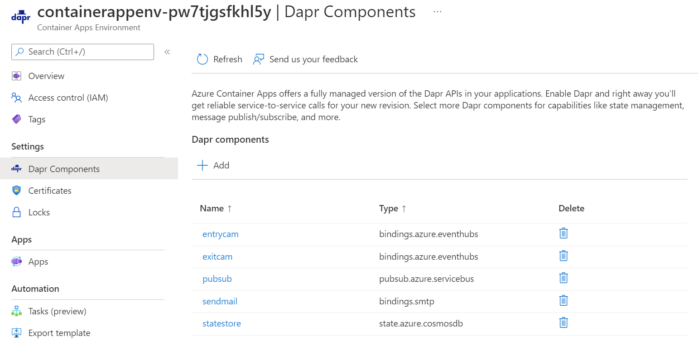
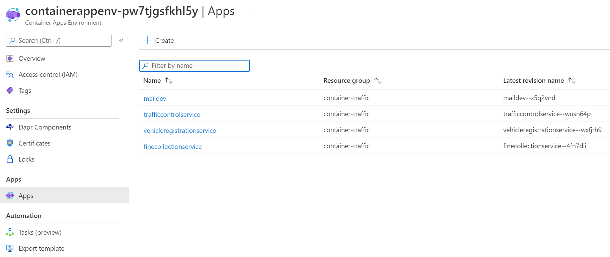

# Challenge 8 - Dapr-enabled Services running in Azure Container App (ACA) - Coach's Guide

[< Previous Challenge](./Solution-08.md) - **[Home](./README.md)**

## Notes & Guidance

In this challenge, you're going to deploy the Dapr-enabled services you have written locally to an [Azure Container Apps (ACA)](https://docs.microsoft.com/en-us/azure/container-apps/) environment.


### Challenge goals

To complete this challenge, you must reach the following goals:

- Successfully deploy all 3 services (`VehicleRegistrationService`, `TrafficControlService` & `FineCollectionService`) to an ACA environment.
- Successfully run the Simulation service locally that connects to your ACA-hosted services

### Step 1: Build container images for each service & upload to Azure Container Registry

You will need to build these services, create a Docker container image that has this source code baked into it and then upload to an Azure Container Registry. The easiest way to do that is to use [ACR tasks](https://docs.microsoft.com/en-us/azure/container-registry/container-registry-tasks-overview).

1. 	Navigate to the `Resources/VehicleRegistrationService` directory & use the Azure Container Registry task to build your image from source.

    ```shell
    az acr build --registry <container-registry-name> --image vehicleregistrationservice:assignment08 .
    ```

1. 	Navigate to the `Resources/TrafficControlService` directory & use the Azure Container Registry task to build your image from source.

    ```shell
    az acr build --registry <container-registry-name> --image trafficcontrolservice:assignment08 .
    ```

1. 	Navigate to the `Resources/FineCollectionService` directory & use the Azure Container Registry task to build your image from source.
  
    ```shell
    az acr build --registry <container-registry-name> --image finecollectionservice:assignment08 .		
    ```

### Step 4: Deploy container images to Azure Container Apps

Now that your container images have been uploaded to the Azure Container Registry, you can deploy these images to your Azure Container Apps. Deployment spec files have been added to each service to make this easier. You will need to customize them to reference your container registry path.

1.	Open the `Resources/Infrastructure/containerapps/main.bicep` file and update the container registry name to be the one you have deployed.

    ```bicep
    param fineCollectionImage string = '<container-registry-name>.azurecr.io/finecollectionservice:assignment08'
    ```

1.  Repeat these steps for the `trafficControlImage` and the `vehicleRegistrationImage` variables.

1.  Get the credentials to pull images from your Azure Container Registry.

    ```shell
    $REGISTRY_USERNAME = az acr credential show -n mycontapp --query username
    $REGISTRY_PASSWORD = az acr credential show -n mycontapp --query passwords[0].value
    ```

    *IMPORTANT: The Azure Container Registry has the **admin** account enabled to make this demo easier to deploy (doesn't require the deployer to have Owner access to the subscription or resource group the Azure resources are deployed to). **This is not a best practice!** *

1. 	Deploy your new services to ACA. Navigate to the `Resources/Infrastructure/containerapps` directory and run the following:

    ```shell
    az group create -n <RESOURCEGROUP_NAME> -l westeurope

    az deployment group create -n container-traffic-app -g <RESOURCEGROUP_NAME> --template-file .\main.bicep -p registry=<container-registry-name> registryUsername=$REGISTRY_USERNAME registryPassword=$REGISTRY_PASSWORD
    ```

    The main.bipep file is going to deploy the following infrastructure components:

    - A Storage Account with a container for the entrycam and another one for the exitcam
    - A Container Apps environment
    - A Cosmos DB as a state store
    - A Service Bus
    - A container with the MailDev image
    - A IoT Hub and a EventHub

    Also, it'll deploy the following dapr components:

    - SMTP binding
    - Entrycam and Exitcam as a eventhub binding
    - Pubsub using Azure Service Bus
    - State Store using Azure Cosmos DB

    And last, it'll deploy the applications:

    - FineCollection service
    - TrafficControl service
    - VehicleRegistration service


1.	Verify your services are running (it may take a little while for all the services to finish starting up). Make sure the **PROVISIONED** status for all Container Apps into the environment and you have all the Dapr Components deployed.

**Deployed Dapr Components**


**Deployed Container Apps**



### Step 7: Run Simulation application

Run the Simluation service, which writes to your IoT Hub's MQTT queue. You will begin to see fines get emailed to you as appropriate.
