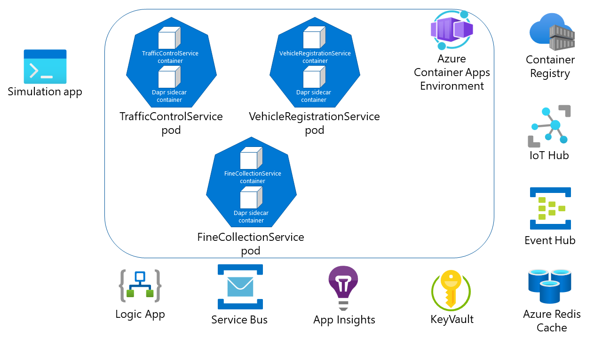

# Challenge 8 - Dapr-enabled Services running in Azure Container Apps (ACA)

[< Previous Challenge](./Challenge-08.md) - **[Home](../README.md)**

## Introduction

In this challenge, you're going to deploy the Dapr-enabled services you have written locally to an [Azure Container Apps (ACA)](https://docs.microsoft.com/en-us/azure/container-apps/) environment.



- Build Docker images of all 3 services & upload to the Azure Container Registry.
- Update all image name URI from the container registry host.
- Deploy your service images to your ACA environment.
- Run your **Simulation** service locally.

## Success Criteria

To complete this challenge, you must reach the following goals:

- Validate that all 3 services are compiled into Docker images & stored in an Azure Container Registry.
- Validate that you have successfully deployed all 3 services (`VehicleRegistrationService`, `TrafficControlService` & `FineCollectionService`) to an ACA cluster.
- Validate that the local **Simulation** service runs & connects to your ACA-hosted services and that all the previous functionality still works (input messages, output messages, speeding violation emails, etc).

## Tips

- Use [ACR Tasks](https://docs.microsoft.com/en-us/azure/container-registry/container-registry-tasks-overview) to simplify creation & deployment of the images to the registry.
- Modify the `Resources/Infrastructure/containerapps/main.bicep` spec files to deploy each service to ACA. You will need to customize them with the names of your specific Azure container registries, etc.
- Use the AZ CLI Deployment command to deploy all the services in the `Resources/Infrastructure/containerapps/` directory simulatiously
  ```shell
    az group create -n <RESOURCEGROUP_NAME> -l westeurope

    az deployment group create -n container-traffic-app -g <RESOURCEGROUP_NAME> --template-file .\main.bicep -p registry=<container-registry-name> registryUsername=$REGISTRY_USERNAME registryPassword=$REGISTRY_PASSWORD
  ```

## Learning Resources

Thanks for participating in these hands-on challenges! Hopefully you've learned about Dapr and how to use it. Obviously, these challenges barely scratch the surface of what is possible with Dapr. We have not touched upon subjects like: hardening production environments, actors, integration with Azure Functions, Azure API Management and Azure Logic Apps just to name a few. So if you're interested in learning more, I suggest you read the [Dapr documentation](https://docs.dapr.io).
